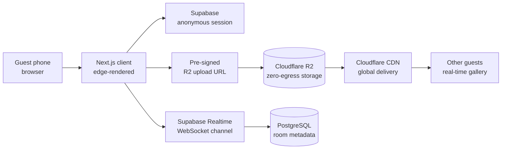

# Groopik

> A frictionless real-time media aggregator for high-concurrency events — college fests, weddings, conferences — built around the design principle that the fastest media-sharing flow is the one that requires no app install and no sign-up.

[](https://groopik.com)
[](#)
[](LICENSE)

---

## The Problem

Existing event-media workflows are broken at the seams that matter most:

- **Friction.** Guests are asked to install an app, sign up, or join a WhatsApp group that breaks at scale.
- **Cost.** Cloud egress fees from typical object storage make a 500-guest event with photos and video uneconomical for organizers.
- **Concurrency.** A college fest with thousands of simultaneous uploaders breaks naïve realtime sync.
- **Discoverability.** Even when media gets uploaded, it scatters across cameras, phones, and chat threads — nobody ever sees the full set.

Groopik exists because the gap between "the event happened" and "the curated shared media of the event exists" is currently filled with WhatsApp groups, manual downloads, and lost photos.

## Motivation

The product hypothesis:

> A zero-install, zero-signup, room-based real-time media aggregator on cost-efficient infrastructure can capture the long-tail event-media market that current platforms (Instagram, WhatsApp, Google Photos shared albums) leave behind.

The engineering hypothesis:

> A modern serverless stack (Next.js + Supabase Realtime + Cloudflare R2 zero-egress storage) can deliver this at consumer-grade UX and a unit-economic price point.

## Engineering Questions

- **EQ1.** How can media uploads be made frictionless — no install, no signup, no account recovery?
- **EQ2.** How can latency and storage cost be minimized for high-concurrency event uploads?
- **EQ3.** How can real-time gallery synchronization scale across thousands of concurrent rooms without manual sharding?
- **EQ4.** How is global media delivery made cost-efficient given the long tail of viewing geographies?

## Architecture



**Key design decisions** (one-line rationale for each, in [`docs/decisions.md`](docs/decisions.md)):

- **Next.js on Vercel edge.** Sub-100ms TTFB globally; built-in image optimization.
- **Supabase anonymous sessions.** No signup wall; room-scoped tokens enforce access without identity.
- **Cloudflare R2 over S3.** Zero egress fees — turns the cost model from per-view to per-storage and unlocks the unit economics.
- **Supabase Realtime over self-hosted WebSocket.** Avoids reinventing connection management; scales per-room out of the box.
- **PostgreSQL for room metadata, R2 for blobs.** Standard separation; lets the relational layer stay small and the storage layer stay cheap.

## What It Does

- **One-tap room creation.** Organizer creates a room, shares a short URL or QR code.
- **Zero-install upload.** Guests open the URL, grant camera/library access, upload. No app, no signup.
- **Real-time gallery.** New uploads appear in every connected guest's gallery within seconds.
- **Bulk download.** Organizer can export the full gallery post-event.
- **Room expiry / archival.** Optional auto-archive after N days to keep storage costs bounded.

## Tech Stack

| Layer | Choice |
|---|---|
| Frontend | Next.js (App Router) · React 18 · TypeScript · Tailwind CSS |
| Realtime | Supabase Realtime (Postgres logical replication → WebSocket) |
| Storage | Cloudflare R2 (S3-compatible, zero-egress) |
| Database | PostgreSQL (via Supabase) |
| Auth | Supabase anonymous sessions with room-scoped JWTs |
| CDN | Cloudflare global edge network |
| Hosting | Vercel (edge functions) |

## Running Locally

```bash
git clone https://github.com/Faizaniqbal52/groopik.git
cd groopik
npm install

# Configure
cp .env.example .env.local
# (edit .env.local with Supabase + R2 credentials)

npm run dev
```

See [`docs/setup.md`](docs/setup.md) for the full setup including Supabase migrations and R2 bucket configuration.

## Deployment

Live at [groopik.com](https://groopik.com) on Vercel. Production deploy is a `git push` to `main`; staging is the `develop` branch on a separate Vercel project.

## Design Decisions and Tradeoffs

Documented in [`docs/decisions.md`](docs/decisions.md):

| Decision | Why | Tradeoff |
|---|---|---|
| Zero-signup (anonymous sessions) | Removes the biggest UX dropoff | Harder to recover "lost" rooms; users must save the room URL themselves |
| Cloudflare R2 over AWS S3 | Zero egress fees enable the per-storage pricing model | Smaller ecosystem; some S3-specific tooling needs adapters |
| Supabase Realtime over Pusher / Ably | Same tool, same database, one bill | Tied to Supabase availability for two layers at once |
| Sub-100ms gallery sync target | Feels "live" rather than "shared album" | Server-side state required; pure-static would not satisfy this |
| Room metadata in PostgreSQL, media in R2 | Standard separation | Eventual consistency between DB row creation and R2 upload completion — handled with optimistic UI + reconciliation |

## Failure Modes Encountered

Honest catalog (`docs/incidents.md`):

- **R2 → CDN cache propagation lag.** First few uploads sometimes 404 for ~500ms; resolved with stale-while-revalidate.
- **Supabase Realtime backpressure under burst.** Spike from 0 → 200 concurrent uploads can stall the channel briefly; mitigated with per-room rate-limiting on the client.
- **Mobile Safari camera permissions.** iOS sometimes silently denies camera access on subdomains; required explicit prompts and a fallback file picker.
- **Large video uploads on flaky networks.** Multi-MB uploads on event Wi-Fi fail mid-stream; resolved by chunked uploads with resume.

## Lessons Learned

- **Zero-signup is the entire product.** Every UX experiment that added an account flow killed adoption.
- **R2's zero-egress is the entire business model.** Without it, the per-view cost model would not work at consumer scale.
- **Real-time sync is a 90/10 problem.** The first 90% (most uploads, most galleries) is easy; the 10% (bursts, slow networks, Safari quirks) is most of the work.
- **PostgreSQL + an object store is a boring stack and that is the point.** Choosing exciting infrastructure would have cost weeks; the boring choices freed effort for the product.

## Future Work

- Native share targets on Android and iOS for one-tap "share to Groopik" from the camera roll.
- Server-side curation (auto-grouping by person/place/event-segment) using on-device or low-cost vision models.
- Organizer analytics dashboard.
- Paid tier for high-storage / long-retention events.

## Limitations

- Currently optimized for events of 50–5000 guests; very small (<10) or very large (>10K) need different cost-tier handling.
- No native mobile app; PWA flow only.
- Single-region database; multi-region rollout planned but not shipped.

## Citation / Reference

If you reference this work in a paper or article:

```
Iqbal, F. (2026). Groopik: A frictionless real-time media aggregator for high-concurrency events.
https://groopik.com · https://github.com/Faizaniqbal52/groopik
```

## Contact

- **Author:** Faizan Iqbal · [herewithfaizan.in](https://herewithfaizan.in) · [ifaizan041@gmail.com](mailto:ifaizan041@gmail.com)
- **Live product:** [groopik.com](https://groopik.com)

## License

MIT — see [LICENSE](LICENSE).
